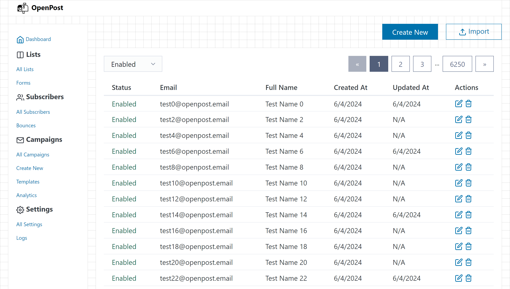

<!-- PROJECT LOGO -->
 

  

<h3 align="center">OpenPost · 📧</h3>

  

    Self-Hosted Newsletters and Email Lists Management
     
    <!-- coming soon
    <a href="https://github.com/xakpc/openpost"><strong>Explore the docs »</strong></a>
     
     
    <a href="https://github.com/xakpc/openpost">View Demo</a>
    ·
    <a href="https://github.com/xakpc/openpost/issues/new?labels=bug&template=bug-report---.md">Report Bug</a>
    ·
    <a href="https://github.com/xakpc/openpost/issues/new?labels=enhancement&template=feature-request---.md">Request Feature</a>
    -->
  

<!-- TABLE OF CONTENTS -->

  
Table of Contents

  <ol>
    <li>
      <a href="#about-the-project">About The Project</a>
      <ul>
        <li><a href="#the-idea-behind-openpost">The idea behind OpenPost</a></li>
        <li><a href="#built-with">Built With</a></li>
      </ul>
    </li>
    <li>
      <a href="#getting-started">Getting Started</a>
      <ul>
        <li><a href="#prerequisites">Prerequisites</a></li>
        <li><a href="#installation">Installation</a></li>
      </ul>
    </li>
    <li><a href="#usage">Usage</a></li>
    <li><a href="#roadmap">Roadmap</a></li>
    <li><a href="#contributing">Contributing</a></li>
    <li><a href="#license">License</a></li>
    <li><a href="#contact">Contact</a></li>
    <!--<li><a href="#acknowledgments">Acknowledgments</a></li>-->
  </ol>

<!-- ABOUT THE PROJECT -->
## About The Project

A free self-hosted open-source solution for managing your email newsletters.

Designed for small businesses, startups, and tech enthusiasts, OpenPost offers a practical alternative to complex and costly email lists and newsletter services.

- Self-host your newsletters for full control and privacy.
- Pay for what you send, and own your data.
- Work locally and on your server.

### The idea behind OpenPost

Let's talk about complexity. It's everywhere today. We're all familiar with the KISS principle, and I believe it **should be applied more often**, especially to the tools we use.

Many newsletter tools have become slow and clunky, crammed with too many features in a bid to outdo competitors. Their primary function—**collecting email lists and sending emails**—gets buried under a heap of unnecessary (at least for me) features.

That's why I created OpenPost: a self-hosted tool built with HTMX and .NET, featuring a minimal UI and a basic set of features. I believe we should be able to manage our emails without all that noise. With OpenPost, you can:

- Work quickly with core features: lists and newsletters
- Pay only for what you send, not for data storage
- Own your email lists

If this resonates with you, you're in the right place. Cheers!

### Built With

* 
* 
* 
* 

Only MIT dependencies.

(<a href="#readme-top">back to top</a>)

<!-- GETTING STARTED -->
## Getting Started

TODO

### Prerequisites

TODO

### Installation

TODO
   

(<a href="#readme-top">back to top</a>)

<!-- USAGE EXAMPLES -->
## Usage

TODO

(<a href="#readme-top">back to top</a>)

<!-- ROADMAP -->
## Roadmap

- [x] Barely Working Version
- [ ] Deployable Version
- [ ] Published Version
- [ ] TODO Plan with 64 steps

See the [open issues](https://github.com/xakpc/openpost/issues) for a full list of proposed features (and known issues).

(<a href="#readme-top">back to top</a>)

<!-- CONTRIBUTING -->
## Contributing

TODO
<!-- 
Contributions are what make the open source community such an amazing place to learn, inspire, and create. Any contributions you make are **greatly appreciated**.

If you have a suggestion that would make this better, please fork the repo and create a pull request. You can also simply open an issue with the tag "enhancement".
Don't forget to give the project a star! Thanks again!

1. Fork the Project
2. Create your Feature Branch (`git checkout -b feature/AmazingFeature`)
3. Commit your Changes (`git commit -m 'Add some AmazingFeature'`)
4. Push to the Branch (`git push origin feature/AmazingFeature`)
5. Open a Pull Request
-->

(<a href="#readme-top">back to top</a>)

<!-- LICENSE -->
## License

TODO

(<a href="#readme-top">back to top</a>)

<!-- CONTACT -->
## Contact

Pavel - [@xakpc](https://x.com/xakpc)

Project Link: [https://github.com/xakpc/openpost](https://github.com/xakpc/openpost)

Website: [openpost.email](https://openpost.email)

(<a href="#readme-top">back to top</a>)

<!-- ACKNOWLEDGMENTS -->
<!--
## Acknowledgments

* 
* 
* 

(<a href="#readme-top">back to top</a>)

-->
